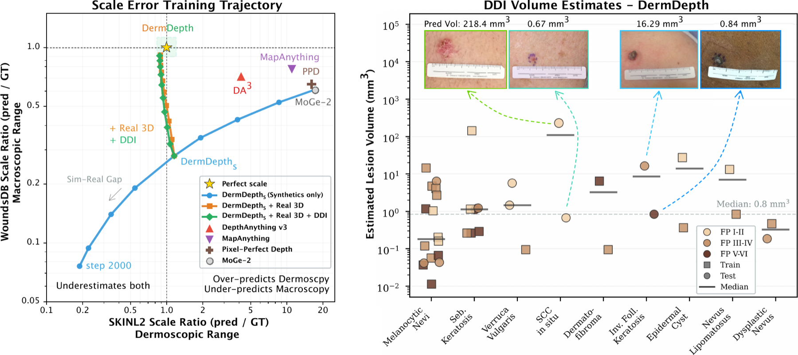
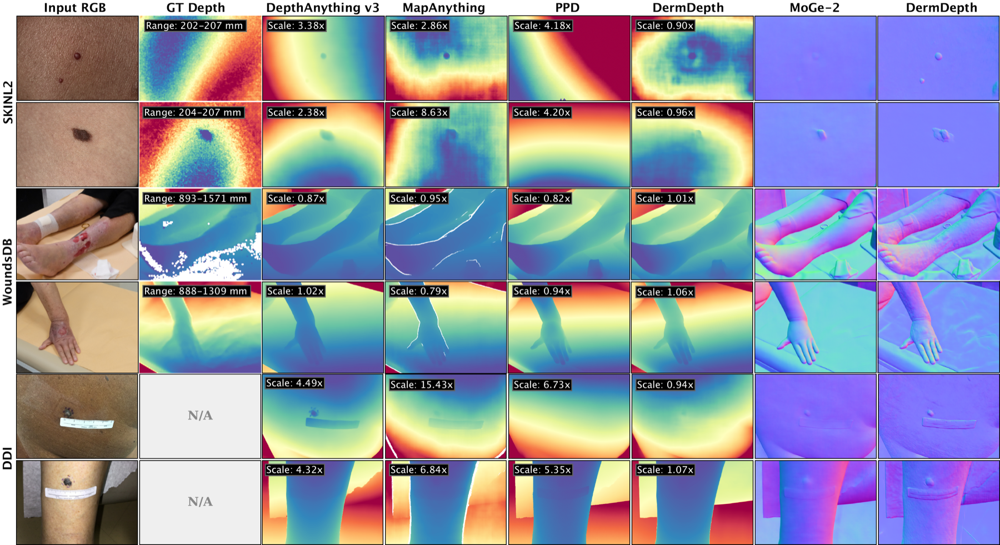
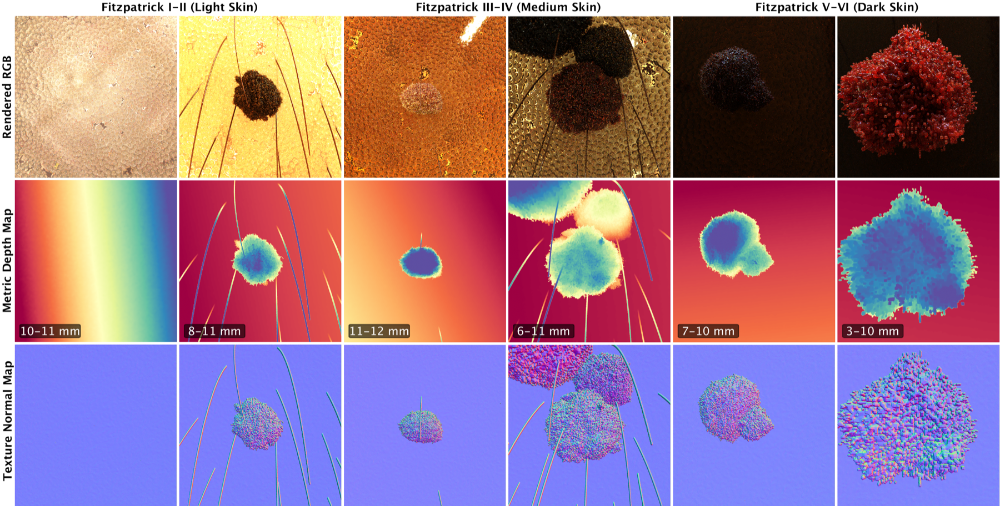

# DermDepth: Toward Monocular Metric Scale 3D Reconstruction Models for Dermatology

[](Paper-5594.pdf)
[](#paper-availability)
[](https://huggingface.co/datasets/hcarrion/D-Synth)
[](https://huggingface.co/hcarrion/DermDepth)
[](LICENSE)

Dermatological practice routinely involves measuring and tracking lesion size, morphology and texture, as critical components of wound or skin cancer screening, monitoring and diagnosis. These objectives naturally benefit from 3D information, yet the standard capture at point of care remains 2D imaging. We present **DermDepth**, the first single-view metric scale 3D model for the dermatological domain and **D-Synth**, the first synthetic dermoscopic dataset with pixel-perfect 3D information. Training DermDepth on D-Synth corrects metric scale error from over 16x to under 1.1x for real dermoscopic data, while preserving geometric quality and increasing texture richness. Fine-tuning on a small amount of real clinical samples generalizes across three real-world benchmarks spanning the few mm to hundred cm range, diverse skin tones, and chronic wound cases.

<p align="center">
  
</p>

## Paper Availability

The MICCAI 2026 camera-ready PDF is hosted directly in this repository: **[Paper-5594.pdf](Paper-5594.pdf)**. The arXiv version is **embargoed by Springer until approximately September 2027** (one year after open-access publication at MICCAI 2026). The version-of-record will appear in the *Lecture Notes in Computer Science* proceedings volume shortly before the conference (Sept 27 – Oct 1, 2026, Strasbourg).

## Key Results

<p align="center">
  
</p>

DermDepth (★) lies closest to the **(1×, 1×)** perfect-scale target on both SKINL2 (dermoscopic) and WoundsDB (macroscopic) benchmarks while all foundation baselines over- or under-predict by **2–16×**. On DDI, predicted lesion volumes match the ranges reported in dermatological literature (right).

| Method | Params | SKINL2 Scale | SI-d1 (%) | WoundsDB Scale | SI-d1 (%) | DDI Ratio |
|--------|:---:|:---:|:---:|:---:|:---:|:---:|
| Depth Anything v3 | 1.4B | 4.16x | 99.6 | 0.67x | 89.1 | 53.6x |
| MapAnything | 1.1B | 10.88x | 99.3 | 0.75x | 80.7 | 156.1x |
| PPD | 831M | 16.21x | 92.0 | 0.66x | 91.3 | 90.4x |
| MoGe-2 | 331M | 16.10x | 100.0 | 0.62x | 91.1 | 81.0x |
| DermDepth_S | 2.1M ft | 1.11x | 100.0 | 0.28x | 91.1 | 9.2x |
| **DermDepth** | **2.1M ft** | **0.87x** | **100.0** | **0.91x** | **92.6** | **1.95x** |

Scale ratio and DDI ratio target = 1.0x. DermDepth_S: synthetic data only. Eval on held-out test sets.

### Qualitative comparison

<p align="center">
  
</p>

Rows: SKINL2 (dermoscopic), WoundsDB (chronic wounds), DDI (diverse skin tones). Columns from left: input RGB, ground-truth depth (when available), DepthAnything v3, MapAnything, PPD, DermDepth, MoGe-2 normals, DermDepth normals. DermDepth's per-pixel `Scale` factors hover around 1.0× across modalities while baselines mis-scale by 2–15×.

### Synthetic training data (D-Synth)

<p align="center">
  
</p>

D-Synth provides 3,132+ rendered dermoscopic samples with pixel-perfect metric depth, surface normals, and camera intrinsics — enabling supervised training where real metric-scale 3D dermatological data does not exist.

## Data

### D-Synth

Pre-generated D-Synth training data is hosted on Hugging Face: [hcarrion/D-Synth](https://huggingface.co/datasets/hcarrion/D-Synth).

```bash
# CLI download
hf download hcarrion/D-Synth --repo-type dataset --local-dir data/dermdepth_train/dsynth

# Or via Python
python -c "from huggingface_hub import snapshot_download; snapshot_download('hcarrion/D-Synth', repo_type='dataset', local_dir='data/dermdepth_train/dsynth')"
```

To generate your own synthetic dermoscopic training data with metric-scale 3D ground truth:

```bash
# Local generation (requires Mitsuba 3 + S-SYNTH assets)
python code/data_generation/generate_dermdepth_dataset.py --num_samples 3000 --output data/dermdepth_train/dsynth

# Or use the Colab notebook for cloud generation
# See notebooks/generate_dermdepth_colab.ipynb
```

### Real Datasets

Download evaluation datasets from their original sources:

- **SKINL2**: [Skin Lesion Light Field Dataset](https://www.it.pt/AutomaticPage?id=3459) (de Faria et al., 2019)
- **WoundsDB**: [Chronic Wound Database](https://chronicwounddatabase.eu/) (Juszczyk et al., 2020)
- **DDI**: [Diverse Dermatology Images](https://aimi.stanford.edu/datasets/ddi-diverse-dermatology-images) (Daneshjou et al., 2022)
- **sDDI**: [DDI segmentation masks](https://github.com/hectorcarrion/FEDD) used for ruler annotation

Then prepare for training/evaluation:

```bash
# Convert evaluation datasets to MoGe format
python code/data_generation/convert_eval_to_moge.py --dataset skinl2 --input data/SKINL2 --output data/dermdepth_train/skinl2_moge
python code/data_generation/convert_eval_to_moge.py --dataset woundsdb --input data/DB_ALL --output data/dermdepth_train/woundsdb_moge

# Create DDI pseudo-GT from ruler annotations
python code/data_generation/create_ddi_training_data.py --input data/DDI --output data/dermdepth_train/ddi_moge
```

## Repository Structure

```
dermdepth/
├── code/
│   ├── analysis/             # Dataset exploration and baseline analysis
│   ├── annotation/           # DDI ruler annotation tools
│   ├── data_generation/      # D-Synth rendering and MoGe format conversion
│   │   ├── generate_dermdepth_dataset.py   # Main D-Synth generation script
│   │   ├── convert_to_moge.py              # S-SYNTH → MoGe format converter
│   │   ├── convert_eval_to_moge.py         # WoundsDB/SKINL2 → MoGe format
│   │   ├── create_ddi_training_data.py     # DDI pseudo-GT from ruler areas
│   │   └── depth_utils.py                  # Depth encoding and intrinsics utils
│   ├── evaluation/           # Metric evaluation scripts
│   │   ├── eval_depth.py                   # Main depth evaluation (scale, AbsRel, SI-d1)
│   │   ├── eval_ddi_rulers.py              # DDI ruler-based evaluation + fairness
│   │   ├── eval_normals.py                 # Surface normal evaluation
│   │   └── eval_baselines.py               # Baseline model evaluation
│   └── visualization/        # Paper figure generation
├── configs/                  # MoGe-2 training configs for all experiments
├── notebooks/
│   └── generate_dermdepth_colab.ipynb      # Colab notebook for D-Synth generation
├── scripts/                  # Evaluation shell scripts
└── LICENSE
```

## Setup

### Dependencies

DermDepth builds on [MoGe-2](https://github.com/microsoft/MoGe). Clone and install it first:

```bash
git clone https://github.com/microsoft/MoGe.git
cd MoGe && pip install -e .
```

Then install additional dependencies:

```bash
pip install accelerate mlflow-skinny
```

For D-Synth data generation, you also need [Mitsuba 3](https://mitsuba-renderer.org/) and [S-SYNTH assets](https://huggingface.co/datasets/didsr/ssynth_data).

### Base Model

Download the MoGe-2 pretrained weights from [HuggingFace](https://huggingface.co/Ruicheng/moge-2-vitl-normal):

```bash
cd MoGe && python -c "from huggingface_hub import hf_hub_download; hf_hub_download('Ruicheng/moge-2-vitl-normal', 'pretrained_moge2.pt', local_dir='.')"
```

### Fine-tuned checkpoints

Checkpoints are hosted on Hugging Face: [hcarrion/DermDepth](https://huggingface.co/hcarrion/DermDepth).

| Filename | Training data | Notes |
|---|---|---|
| `DermDepth_Synth.pt` | D-Synth only | "DermDepth_S" in the paper (synthetic-only baseline). |
| `DermDepth_Synth_SKINL2_WoundsDB.pt` | D-Synth → SKINL2 + WoundsDB | Intermediate stage. |
| `DermDepth_Synth_SKINL2_WoundsDB_DDI.pt` | D-Synth → SKINL2 + WoundsDB → DDI pseudo-GT | **Best model** (paper "DermDepth" results). |
| `DermDepth_Synth_Normals.pt` | D-Synth, normal-head emphasis | Alternative for normal-map use. |

```bash
# Single checkpoint
python -c "from huggingface_hub import hf_hub_download; hf_hub_download('hcarrion/DermDepth', 'DermDepth_Synth_SKINL2_WoundsDB_DDI.pt', local_dir='checkpoints')"

# All checkpoints
hf download hcarrion/DermDepth --local-dir checkpoints
```

## Training

DermDepth uses progressive training with scale-head-only fine-tuning:

```bash
cd MoGe

# Stage 1: Synthetic-only (scale head, ~2.5h on 1x A100)
python -m moge.train --config ../configs/dermdepth_exp_a.json --workspace ../output/training/exp_a

# Stage 2: + Real data (WoundsDB + SKINL2)
python -m moge.train --config ../configs/dermdepth_exp_g.json --workspace ../output/training/exp_g

# Stage 3: + DDI pseudo-GT (best model)
python -m moge.train --config ../configs/dermdepth_exp_h.json --workspace ../output/training/exp_h
```

## Evaluation

```bash
# Evaluate on SKINL2
python code/evaluation/eval_depth.py --model MoGe/pretrained_moge2.pt --dataset skinl2 --split test

# Evaluate on WoundsDB
python code/evaluation/eval_depth.py --model MoGe/pretrained_moge2.pt --dataset woundsdb --split test

# Evaluate on DDI (with ruler GT and fairness analysis)
python code/evaluation/eval_ddi_rulers.py --model MoGe/pretrained_moge2.pt --split test

# Evaluate baselines (DA3, MapAnything, PPD)
python code/evaluation/eval_baselines.py --method da3 --dataset skinl2
```

## Acknowledgments

This work builds on:
- [MoGe-2](https://github.com/microsoft/MoGe) (Wang et al., 2025) for the base architecture
- [S-SYNTH](https://github.com/DIDSR/ssynth-release) (Kim et al., MICCAI 2024) for the synthetic skin rendering framework

## Citation

```bibtex
@inproceedings{carrion2026dermdepth,
  title     = {DermDepth: Toward Monocular Metric Scale 3D Reconstruction Models for Dermatology},
  author    = {Carri{\'o}n, H{\'e}ctor and Norouzi, Narges},
  booktitle = {Medical Image Computing and Computer-Assisted Intervention (MICCAI)},
  year      = {2026},
  publisher = {Springer},
  series    = {Lecture Notes in Computer Science}
}
```

## License

See [LICENSE](LICENSE) for details.
